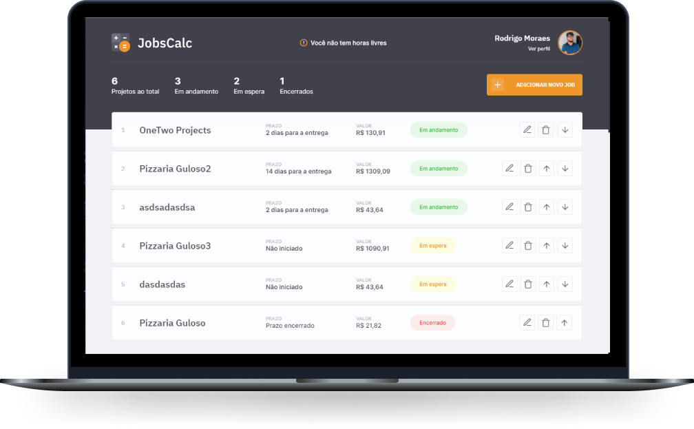

<h1 align="center">
  
</h1>

  <a href="#-tecnologias">Tecnologias</a>&nbsp;&nbsp;&nbsp;|&nbsp;&nbsp;&nbsp;
  <a href="#-projeto">Projeto</a>&nbsp;&nbsp;&nbsp;|&nbsp;&nbsp;&nbsp;
  <a href="#-layout">Layout</a>&nbsp;&nbsp;&nbsp;|&nbsp;&nbsp;&nbsp;
   <a href="#%EF%B8%8F-modificações-do-projeto-principal">Modificações</a>&nbsp;&nbsp;&nbsp;|&nbsp;&nbsp;&nbsp;
  <a href="#memo-licença">Licença</a>

 

  

 

  

## 🚀 Tecnologias

Esse projeto foi desenvolvido com as seguintes tecnologias:

- HTML
- CSS
- JavaScript
- NodeJS
- EJS
- Express
- SQLite

## 💻 Projeto

O JobsCalc é uma aplicação de estimativa de cálculo para projetos freelancer, onde é possível cadastrar e excluir jobs (projetos), obtendo uma estimativa de custo de cada job. Além disso, é possível traçar o valor da hora da pessoa que estará usando o sistema 💰

## 🔖 Layout

Você pode visualizar o layout do projeto através [desse link](https://www.figma.com/file/s4fytPFbDiSkv4GPSfKaLE/Jobs-Planning). É necessário ter conta no [Figma](https://figma.com) para acessá-lo.

## ✏️ Modificações do Projeto principal

- [X] Adicionar duas imagens de arrows para cima e para baixo
- [X] Editar o front-end para adicionar as arrows ao lado dos botões
- [X] Adicionar estilos css aos botões e aplicar a função disable para eles sumirem dependendo da situação
- [X] Adicionar scripts de Modal dos wrapped para os botões up/down/delete
- [X] Ajustar o front-end ejs/css dos wrapped dos botões up/down/delete
- [X] Adicionar no Front-end e no Back-end uma pagina basica de "not-found"
- [X] Adicionar campos no banco de dados para armazenar quando os trabalhos são iniciados e qual é seu status
- [X] Adicionar no Job Controllers as funções de subir e descer um card
- [X] Ajustar o método Get, Update e Delete, no model do Job
- [X] Adicionar os métodos de up,down no model do Job
- [X] Ajustar os controllers do DashBoard para compreender o novo método de exibição
- [X] Fazer um calculo toda vez que abrir o index e atualizar o banco de dados
- [X] Criar rotas tipo post para atualizar os cards usando os botões up and down
- [X] Criar rotas para o not-found
- [X] Criar uma nova lógica no remainingDays (usando o initial_job)
- [X] Editar o Front-End com as alterações do backend do Dashboard (alterar a forma de como ele apresenta os "ID", deixar de ser o "ID própriamente dito)
- [X] Refatorar os códigos do DashBoardController
- [X] Atualizar a forma de visibilidade do status no DashBoard (index.ejs)
- [X] Ao criar um job verificar se o tempo por dia não ultrapasse 24hrs e nem o tempo estabelecido no perfil e não pode ser menor ou igual a 0
- [X] Ao criar o nome do Job não pode ser vazio
- [X] Ao criar o job o numero de horas totais não pode ser menor que 0,
- [X] Ao atualizar o nome do Job não pode ser vazio
- [X] Ao  atualizar um job verificar se o tempo por dia não ultrapasse 24hrs e nem o tempo estabelecido no perfil e não pode ser menor que 1 hora
- [X] Ao atualizar o numero total de horas de um job deve ser maior que 0 horas
- [X] Ao atualizar o perfil verificar se as horas trabalhadas por dia não está passando de 24 hrs
- [X] Ao atualizar o perfil verificar se as horas trabalhadas não está diminuindo o tempo menor que um day_hours de um job
- [X] Ao atualizar o perfil verificar se ele não está passando de 7 dias por semana ou com menos de 1 dia por semana
- [X] Ao atualizar o perfil verificar se ele não tirando férias mais semanas que tem no ano, ou semanas negativas
- [X] Ao atualizar o perfil verificar se o nome não está vazio
- [X] Ao atualizar o perfil verificar se a foto não está vazia
- [X] Verificar ao atualizar o perfil se o valor mensal é maior que 0
- [X] Verificar o tipo de dado no valor mensal na hora de atualizar
- [X] Subir uma tarefa e atualizar se a tarefa for uma troca entre um "to-do" e um "progress"(inicialmente alertar que a decisão pode resetar o tempo da tarefa)
- [X] Descer uma tarefa e atualizar se a tarefa for uma troca entre um "to-do" e um "progress"(inicialmente alertar que a decisão pode resetar o tempo da tarefa)
- [X] Ao atualizar o job que está em "progress" não deixar alterar as horas trabalhadas por dia
- [X] Ao atualizar o perfil avisar ao usuario que as alterações das horas por dia só afetaram os trabalhos "a fazer" para não implicar em uma perda de atividades até normalizar o sistema
- [X] Mudado o método de calculo de dias para a entrega do job, levando em consideração os dias não trabalhados (Dias que eu quero trabalhar na semana + dias não trabalhados = total de dias pra entrega).

## :memo: Licença

Esse projeto está sob a licença MIT. Veja o arquivo [LICENSE](.github/LICENSE.md) para mais detalhes.

---

Feito com ♥ by Rodrigo (Projeto da Rocketseat) :wave: [Participe da nossa comunidade!](https://discordapp.com/invite/gCRAFhc)
